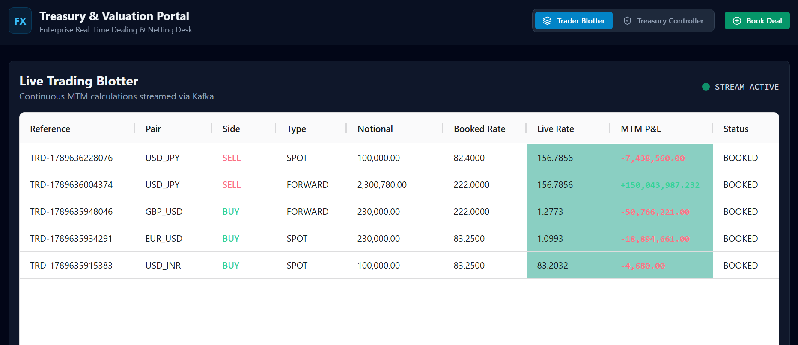
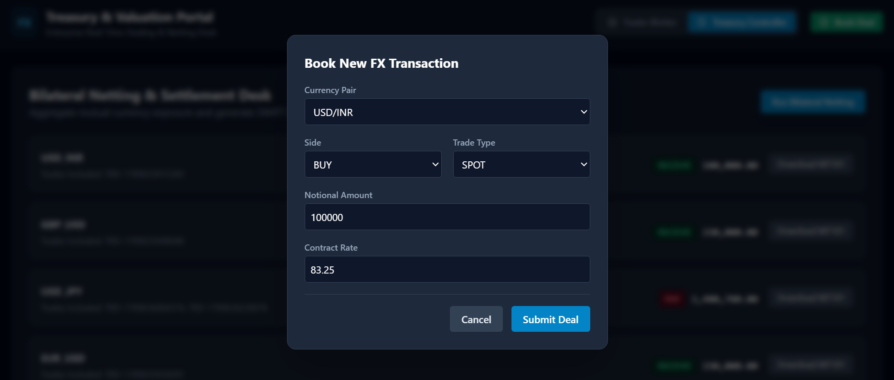
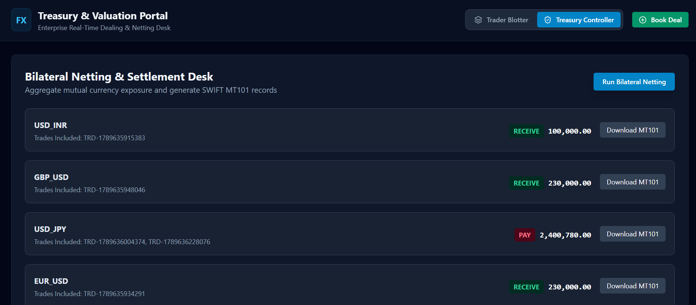
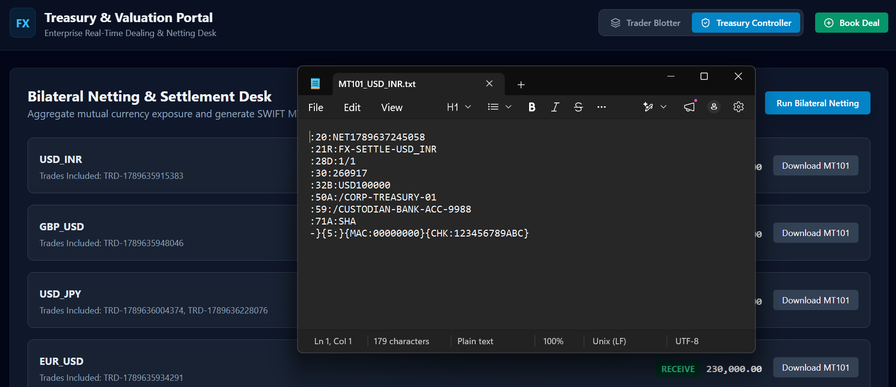

# Real-Time FX & Treasury Portal

An event-driven foreign exchange dealing, Mark-to-Market (MTM) valuation, and settlement engine built with **Java 21**, **Spring Boot 3**, **Apache Kafka (KRaft)**, **Redis**, and a real-time **React/AG-Grid** blotter.


---

## Screenshots









---

## Architecture Overview

```text
[ React 18 / AG-Grid (Port 5173) ]
│
├── SSE Stream / HTTP
▼
[ Spring Cloud Gateway (Port 8080) ] ──(JWT RBAC: ROLE_TRADER / ROLE_CONTROLLER)
│
┌──────┴──────────────────────────┐
▼                                 ▼
[ trade-capture-service (:8081) ]  [ settlement-service (:8083) ]
│ (Transactional Outbox)          │ (Bilateral Netting Run)
▼                                 ▼
[ Kafka: fx.trades.raw ]         [ SWIFT MT101 Generator ]
│
▼
[ valuation-engine (:8082) ] ◄── [ Synthetic Market Ticks (:quotes) ]
├── Redis Rate Cache & Idempotency Filter
└── Kafka Dead-Letter Topic (fx.trades.DLT)
```

## Key Architectural Patterns

- **Transactional Outbox Pattern**: Decouples PostgreSQL trade bookings from Kafka message dispatching, eliminating partial dual-write failure states.
- **Consumer Deduplication & Idempotency**: Employs Redis atomic key caching (`SETNX` with 24h TTL) to prevent duplicate processing on at-least-once Kafka deliveries.
- **Dead-Letter Topic (DLT)**: Isolates poison-pill payloads to `fx.trades.DLT` after retries, preventing consumer group head-of-line blocking.
- **Sub-50ms MTM Revaluations**: Avoids continuous database hits on price changes by keeping active contracts in memory and rate lookups in Redis.
- **SWIFT MT101 Settlement Engine**: Aggregates open counterparty positions into net payment orders formatted according to ISO banking standards.

## Tech Stack

- **Backend**: Java 21, Spring Boot 3.2, Spring Cloud Gateway, Spring Data JPA
- **Messaging & Cache**: Apache Kafka 3.7 (KRaft), Redis 7
- **Database**: PostgreSQL 16
- **Frontend**: React 18, TypeScript, Vite, AG-Grid Community, Tailwind CSS
- **Observability**: Spring Boot Actuator, Micrometer, Prometheus, Grafana

## Quick Start Guide

### 1. Spin up Infrastructure

```bash
cd docker
docker compose up -d
```

### 2. Run Backend Services

Start each service using your IDE or via terminal:
- backend/api-gateway (Port 8080)
- backend/trade-capture-service (Port 8081)
- backend/valuation-engine (Port 8082)
- backend/settlement-service (Port 8083)

### 3. Launch Frontend

```bash
cd frontend/treasury-ui
npm install
npm run dev
```

Open http://localhost:5173 to access the trading blotter and controller desk.